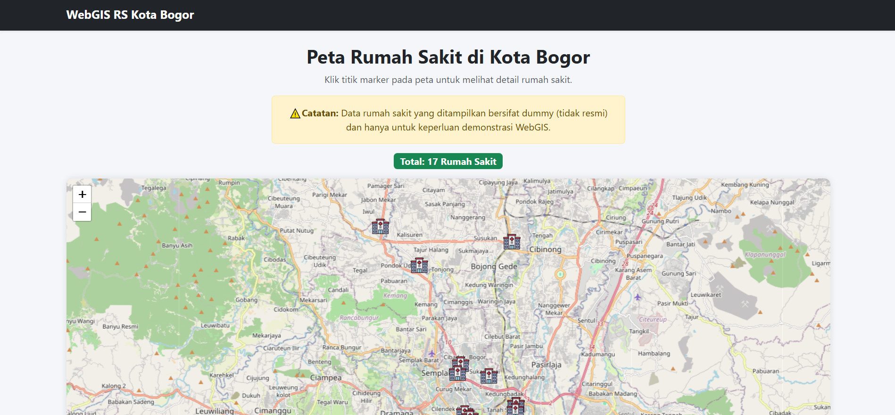

# 🗺️ WebGIS Rumah Sakit di Kota Bogor

Proyek ini merupakan WebGIS sederhana berbasis **Leaflet.js** yang menampilkan lokasi rumah sakit di Kota Bogor. Data yang ditampilkan bersifat **dummy/hardcoded** dan tidak merepresentasikan data resmi.

 <!-- opsional jika kamu ingin menambahkan tangkapan layar -->

## 🔍 Fitur

- Menampilkan peta Kota Bogor dengan titik-titik lokasi rumah sakit.
- Klik pada marker (ikon rumah sakit) untuk melihat detail informasi rumah sakit.
- Menggunakan ikon rumah sakit custom untuk visualisasi yang lebih baik.
- Tampilan modern dan responsif dengan Bootstrap 5.
- Menampilkan jumlah total rumah sakit yang ada di peta.
- Peringatan yang menjelaskan bahwa data bersifat simulasi.

## ⚠️ Catatan Penting

> **Peringatan:**  
> Data rumah sakit pada proyek ini merupakan data **dummy/simulasi** yang di-_hardcode_ menggunakan format GeoJSON.  
> **Tidak menggunakan data resmi dari pemerintah maupun sumber terpercaya.**

---

## 🚀 Cara Menjalankan

1. **Clone repositori ini:**

```bash
git clone https://github.com/pinje0/webgis-assignment-s8.git
cd webgis-assignment-s8
```
